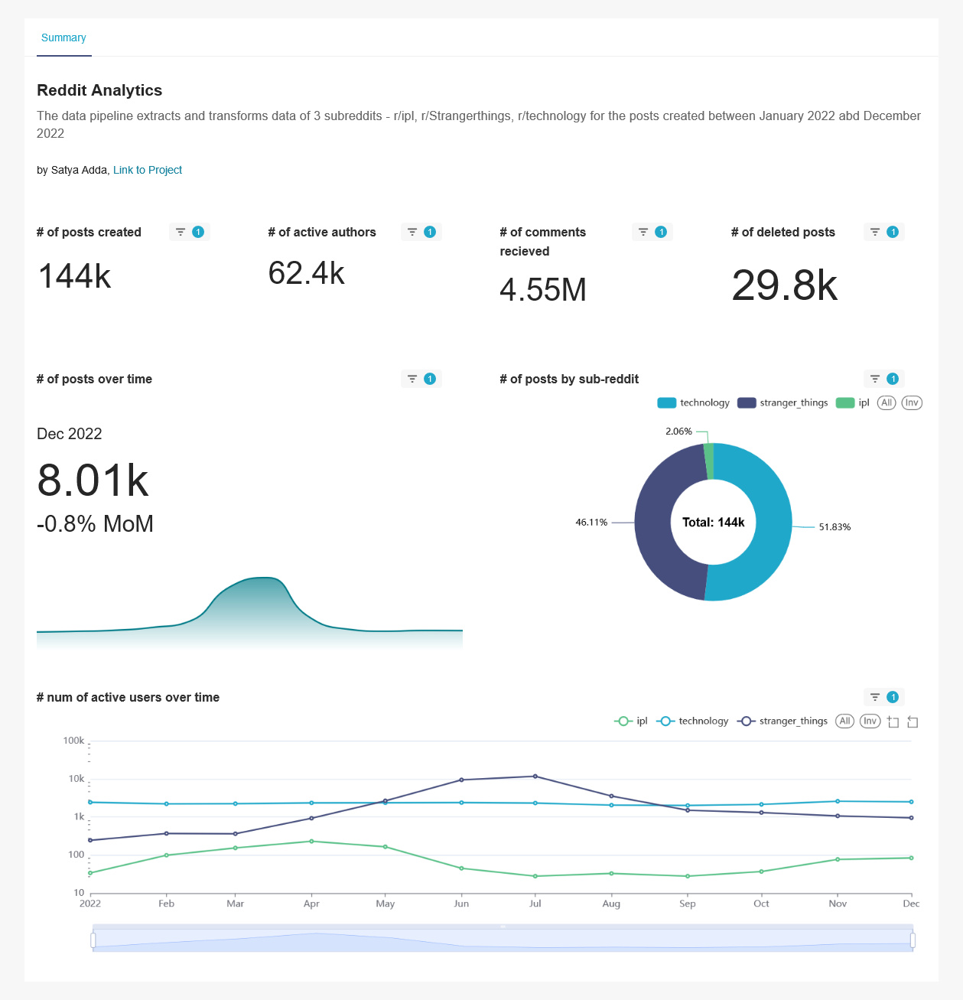

## Reddit-API-data-pipeline

## Objective:
Create a batch data pipeline to ingest Reddit data from its API (for any chosen sub-reddit). The end goal is build a dashboard/report, providing insight into the user engagement metrics of the selected subreddits.

### Architecture/Flow:
<!-- ") -->

**pre-requisites**: 
- GCP Account & Terraform (Cloud Storage & Biq Query will be used).
- Make sure Docker is installed & Logged in to the Docker CLI using `docker login`.
- Install Requirements using `requirements.txt` to test/run the code.
- Reddit API requires Auth, login & create an [app](https://www.reddit.com/prefs/apps) to get credentials (skip if using pushshift API).
- Singup for a free dbt cloud developer account & connect with github to read/write to this git repo.

### Steps/Instructions:

1. Run terraform to create/update GCP infra. Refer the folder .
2. To extract and store the data to GCS, run `python3 /scripts/test_pushshift.py`.
3. To create big query external tables, run `python3 /scripts/test_bq_load.py`.
4. Automate the steps 2 & 3 to run monthly using Airflow. Refer  for detailed steps.
4. Transform data using dbt & Create a data mart. Refer  for detailed steps.
5. Connect Superset to bigquery &  use newly created data mart to visualise/report.

### Result/Output:

**Important Note:** 
- preset.io (or superset) doesnt allow public dashboard sharing outside of workspace (users needs to be in same workspace for sharing to work). hence this dashboard will be unavailble publicly.
