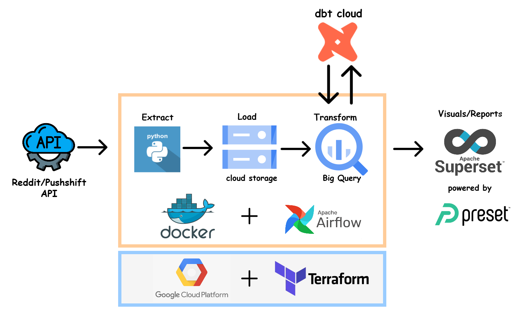

## Reddit-API-data-pipeline

**pre-requisites**: 
- GCP Account & Terraform (Cloud Storage & Biq Query will be used).
- Make sure Docker is installed & Logged in to the Docker CLI using `docker login`.
- Install Requirements using `requirements.txt` to test/run the code.
- Reddit API requires Auth, login & create an [app](https://www.reddit.com/prefs/apps) to get credentials (skip if using pushshift API).
- Singup for a free dbt cloud developer account & connect with github to read/write to this git repo.

### Architecture/Flow:

<!-- ") -->

### Steps/Instructions:

1. Run terraform to create/update GCP infra. Refer the folder .
2. To extract and store the data to GCS, run `python3 /scripts/test_pushshift.py`.
3. To create big query external tables, run `python3 /scripts/test_bq_load.py`.
4. Automate the steps 2 & 3 to run monthly using Airflow. Refer  for detailed steps.
4. Transform data using dbt & Create a data mart. Refer  for detailed steps.
5. Connect Superset to bigquery &  use newly created data mart to visualise/report.