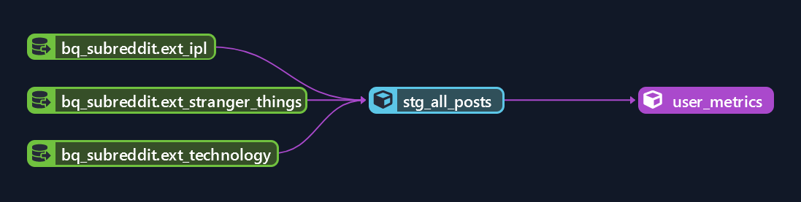

### Dbt project to transform reddit data in big query.

Contains dbt project, with necessary staging & mart models for Reddit API data pipeline.

#### Dbt commands to try:
- `dbt deps` pulls the most recent version of the dependencies listed in your packages.yml from git.
- `dbt build`: Builds, tests and runs the selected resources such as models, seeds, snapshots, and tests. 
- `dbt run`: Runs/Directly executes selected sql model files against the current target database.
- `dbt test`: Only executes the tests you defined for your project.

#### Execution steps
- Login into dbt cloud IDE & open this project (choose `/dbt` folder as dbt home in the settings).
- Update the big query dataset & table names if you have used different ones.
- Build the models
    ```shell
    # builds the models in staging folder
    dbt build --select staging

    # builds the models in staging folder
    dbt build --select marts
    ```
- Make sure they run successfully & Scehdule the dbt runs for this project in dbt cloud (using the UI).





### Dbt Resources:
- Learn more about dbt [in the docs](https://docs.getdbt.com/docs/introduction)
- Check out [Discourse](https://discourse.getdbt.com/) for commonly asked questions and answers
- Join the [dbt community](http://community.getbdt.com/) to learn from other analytics engineers
- Find [dbt events](https://events.getdbt.com) near you
- Check out [the blog](https://blog.getdbt.com/) for the latest news on dbt's development and best practices
